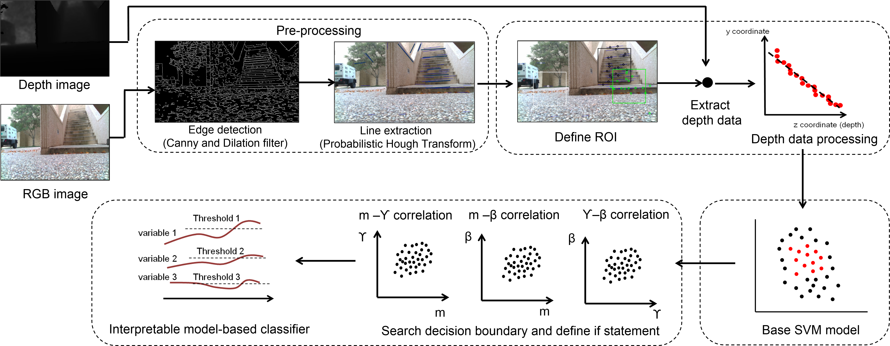
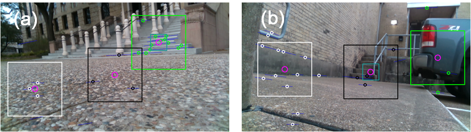
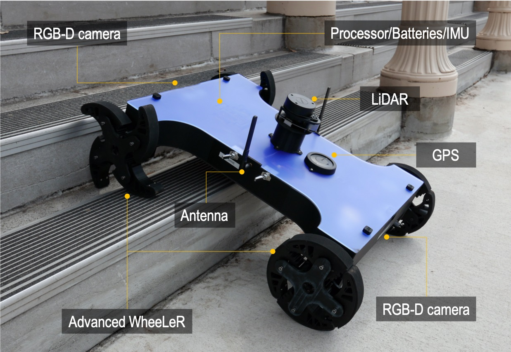
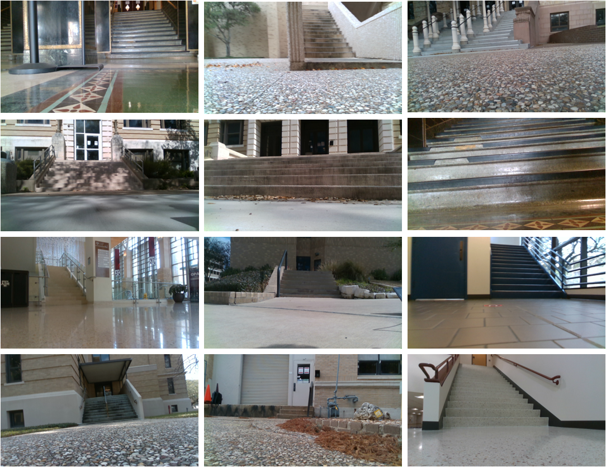

<h1>Intepretable model for stair detection with low height UGV</h1>

## Overview
Robots capable of traversing flights of stairs play an important role in both indoor and outdoor applications. The capability of accurately identifying a staircase is one of the vital technical functions in these robots. This paper presents a vision-based ascending stair detection algorithm using RGB-Depth (RGB-D) data based on an interpretable model. The method follows the four steps: **1)** pre-processing of RGB images for line extraction by applying the dilatation and Canny filters followed by the probabilistic Hough line transform, **2)** defining the regions of interests (ROIs) via K- mean clustering, **3)** training the initial model based on a support vector machine (SVM) using three extracted features (i.e., gradient, continuity factor, and deviation cost), and **4)** building an interpretable model for stair classification by determining the decision boundary conditions. The developed method was evaluated for its performance using our dataset, and the results showed 85% sensitivity and 94% specificity. When the same model was tested on a different test set, the sensitivity and specificity slightly decreased to 80% and 90%, respectively. By shifting the boundary conditions using only a small subset of the new dataset without rebuilding the model, performance was improved to 90% sensitivity and 96% specificity. The presented method is also compared with existing SVM- and neural- network- based methods.







## Robot Platfrom




### Stair Dataset Download (Texas A&M University stair dataset) 


**No. stair images : 2276  No. non_stair images : 546**


Dataset includes rgb/depth pair images

**Caemra Info for dataset creation**


Model : Intel RealSense D435i
Image height : 480, Image width : 848
depth scale factor = 0.001
fx = 425, fy = 425, px = 423, py = 239


**TAMU stair dataset** ([Download 2.0GB](https://drive.google.com/file/d/1QXLhd0iGlAoUfVrATXU_1145bbJWMgmR/view?usp=sharing))





**Same stair with different distance**


**Same stair with different view angle**


## Citation
```
INPROCEEDINGS{9812456,
  author={Lee, Kangneoung and Kalyanram, Vishnu and Zhengl, Chuanqi and Sane, Siddharth and Lee, Kiju},
  booktitle={2022 International Conference on Robotics and Automation (ICRA)}, 
  title={Vision-based Ascending Staircase Detection with Interpretable Classification Model for Stair Climbing Robots}, 
  year={2022},
  volume={},
  number={},
  pages={6564-6570},
  doi={10.1109/ICRA46639.2022.9812456}}
```
